<!-- Palette: bg #0D1117 · purple #A855F7 · cyan #22D3EE · text #E6EDF3 · border #30363D -->

<div align="center">



<a href="https://github.com/yaseinHburqan">
  
</a>

<br/>


</div>


##  About me

<table>
<tr>
<td width="55%" valign="top">

I design and build **scalable, modern and high-performance web applications** — clean, layered
back ends and fast, accessible front ends.

- **Back end** — .NET, ASP.NET Core, EF Core, SQL Server
- **Front end** — Blazor, React, Angular, Next.js
- **CMS** — Umbraco and headless content platforms
- **Craft** — Clean Architecture, REST APIs, Docker, automated tests
- **Now** — exploring AI-assisted development workflows

</td>
<td width="45%" valign="top">

```csharp
public sealed record Developer
{
    public string Name => "Yasein Burqan";
    public string Role => "Full-Stack Developer";

    public string[] Stack =>
    [
        ".NET", "Blazor", "React",
        "Angular", "Next.js", "Umbraco"
    ];

    public string Motto =>
        "Clean code, clear boundaries.";
}
```

</td>
</tr>
</table>


##  Tech stack

<div align="center">

**Languages & frameworks**


**Data, cloud & tooling**


<br/><br/>


</div>


##  GitHub stats

<div align="center">


<br/><br/>

<picture>
  <source media="(prefers-color-scheme: dark)" srcset="https://raw.githubusercontent.com/yaseinHburqan/yaseinHburqan/output/github-snake-dark.svg" />
  
</picture>

</div>


